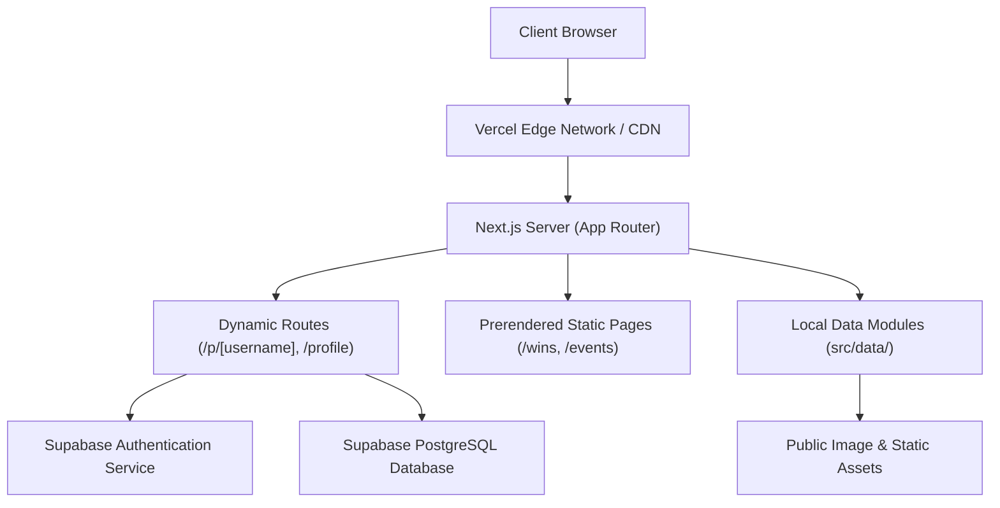
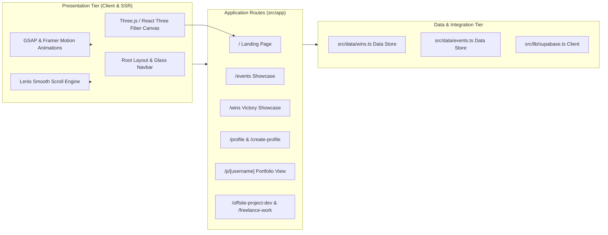

# Invictus Club Platform

<p align="center">
  
  
  
  
  
  
</p>

---

## Executive Summary

**Invictus Club Platform** is the flagship web application for Invictus Club, an elite technical community and developer hub. Built with Next.js 16 (App Router), React 19, TypeScript, and Tailwind CSS v4, the platform showcases club initiatives, national hackathon victories, upcoming events, research publications, freelance offerings, and member portfolios.

> [!NOTE]
> Designed for high-performance deployment on Vercel with automated build optimizations, dynamic routes, and static generation.

---

## High-Level Architecture (HLA)

The system follows a modern Jamstack pattern leveraging Next.js App Router, edge caching, static site generation (SSG), server-side rendering (SSR), and Supabase Backend-as-a-Service.



---

## Low-Level Architecture (LLA)



---

## About Invictus Club

Invictus Club is a premier student developer committee dedicated to engineering excellence, competitive programming, hackathon dominance, and cutting-edge software development. Members collaborate on real-world industry applications, publish academic research, and compete at national-level hackathons.

### Key Benefits of Joining Invictus Club

- **Monthly Offsite Travel & Retreats**: Unwind and build team cohesion with sponsored offsite trips, hackathon travel support, and team getaways across nature spots and tech hubs.
- **Bi-Weekly Hangouts**: Casual meetups, informal gaming sessions, technical code jams, and pizza nights to foster authentic friendships outside of project deadlines.
- **Weekly Google Meet Syncs**: Regular online committee check-ins, project progress reviews, mentorship office hours, and knowledge sharing ensuring every member feels a strong sense of community and active ownership.

---

## Key Features & Platform Modules

| Route | Description | Technical Highlights |
| :--- | :--- | :--- |
| `/` | Main Club Portal | Three.js interactive 3D mesh canvas, GSAP timeline animations, responsive achievement metrics |
| `/wins` | Hall of Fame | Categorized grid displaying trophies, certificates, prize details, and lightbox preview modals |
| `/events` | Club Timeline | Categorized event cards (Upcoming, Ongoing, Past) with gallery trigger previews |
| `/hackathons` | National Competitions | Detailed breakdown of national hackathon entries, prize money, and winning team rosters |
| `/ideathons` | Innovation Pitches | Innovation problem statements grid, tech stack tags, and judging criteria modals |
| `/project-contests` | Coding Challenges | Competition listings, guidelines, and project submission leaderboards |
| `/offsite-project-dev` | Client Development | Portfolio showcasing offsite client software projects engineered by club members |
| `/freelance-work` | Developer Intake | Client inquiry form and freelance service catalog |
| `/paper-poster` | Academic Publications | Conference paper catalog, citation links, and abstract reader modals |
| `/research` | Club Research | Research domains overview, paper downloads, and academic contributions |
| `/profile` | Member Dashboard | Protected user profile manager with dynamic portfolio preview iframe |
| `/create-profile` | Profile Editor | Interactive profile details form and social handles builder |
| `/p/[username]` | Public Developer Portfolios | Dynamic route serving standalone rendered developer profile portfolios |

---

## Project Directory Structure

```
invictus-club/
|-- src/
|   |-- app/
|   |   |-- layout.tsx
|   |   |-- page.tsx
|   |   |-- globals.css
|   |   |-- create-profile/page.tsx
|   |   |-- events/page.tsx
|   |   |-- freelance-work/page.tsx
|   |   |-- hackathons/page.tsx
|   |   |-- ideathons/page.tsx
|   |   |-- login/page.tsx
|   |   |-- offsite-project-dev/page.tsx
|   |   |-- p/[username]/page.tsx
|   |   |-- paper-poster/page.tsx
|   |   |-- profile/page.tsx
|   |   |-- project-contests/page.tsx
|   |   |-- research/page.tsx
|   |   `-- wins/
|   |       |-- page.tsx
|   |       `-- WinsClient.tsx
|   |-- components/
|   |   |-- Navbar.tsx
|   |   |-- Footer.tsx
|   |   `-- home/OpportunitiesSection.tsx
|   |-- data/
|   |   |-- events.ts
|   |   `-- wins.ts
|   `-- lib/
|       `-- supabase.ts
|-- public/
|   |-- portfolio-profile.html
|   `-- images, icons, banners
|-- package.json
|-- tsconfig.json
|-- next.config.ts
`-- README.md
```

---

## Local Development Setup

> [!IMPORTANT]
> Ensure Node.js 18+ and npm are installed on your machine before running the setup commands.

### 1. Clone & Install Dependencies

```bash
git clone https://github.com/yashkoparde/Invictus.git
cd Invictus
npm install
```

### 2. Configure Environment Variables

Create a `.env.local` file in the root directory:

```env
NEXT_PUBLIC_SUPABASE_URL=your_supabase_project_url
NEXT_PUBLIC_SUPABASE_ANON_KEY=your_supabase_anon_key
```

### 3. Run Development Server

```bash
npm run dev
```

Open `http://localhost:3000` in your web browser.

---

## Production Build & Vercel Deployment

To test a production build locally:

```bash
npm run build
npm run start
```

### Deploying to Vercel

1. Push your changes to GitHub.
2. Import the repository in [Vercel Dashboard](https://vercel.com).
3. Set the Framework Preset to **Next.js**.
4. Add environment variables (`NEXT_PUBLIC_SUPABASE_URL`, `NEXT_PUBLIC_SUPABASE_ANON_KEY`).
5. Click **Deploy**.

> [!TIP]
> Next.js 16 Turbopack is pre-configured in `next.config.ts` for fast build execution times on Vercel infrastructure.

---

## Content Management Guide

All events and victory entries are managed via lightweight TypeScript data modules without needing database edits:

- **Adding Wins**: Update `src/data/wins.ts` with victory details, position, display dates, and image paths.
- **Adding Events**: Update `src/data/events.ts` with event titles, status (`UPCOMING`, `ONGOING`, `PAST`), and categories.

---

## Technology Stack

- **Framework**: Next.js 16 (Turbopack, App Router)
- **Language**: TypeScript 5
- **UI & Components**: React 19, Lucide React Icons
- **Styling**: Tailwind CSS v4, PostCSS
- **Animations**: GSAP (ScrollTrigger), Framer Motion, Lenis Smooth Scroll
- **3D Graphics**: Three.js, React Three Fiber, React Three Drei
- **Backend & Auth**: Supabase JavaScript SDK
- **Deployment Platform**: Vercel Edge Network
